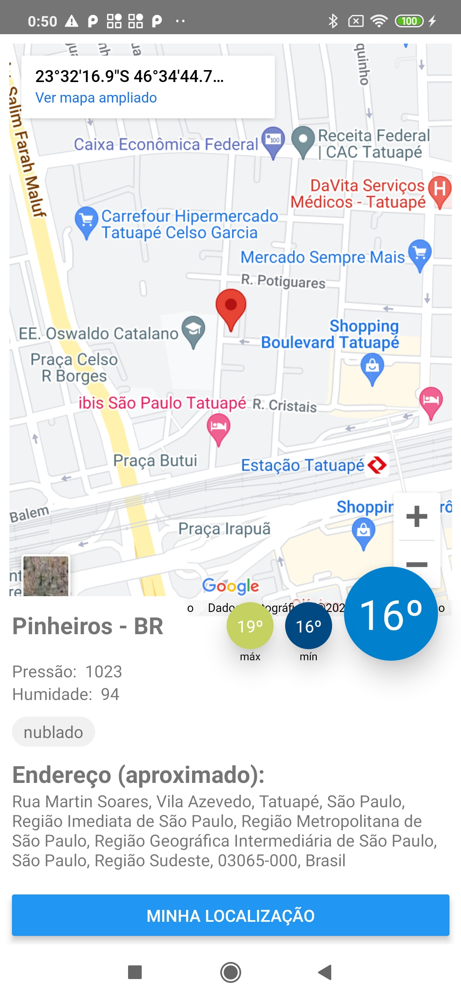

# App Previsão do tempo e endereço
## em: React Native

- Busca dados de localização
- Busca dados de previsão do tempo
- Busca endereço aproximado via geo-localização



## Libs

- react-native
- redux
- geolocation
- jest

## Setup

```
npm install
```

## Run App Local

### Android
```
npx react-native run-android
```

### IOS
```
npx react-native run-ios
```

## Publish App

### Android
https://reactnative.dev/docs/signed-apk-android

### IOS
https://reactnative.dev/docs/publishing-to-app-store